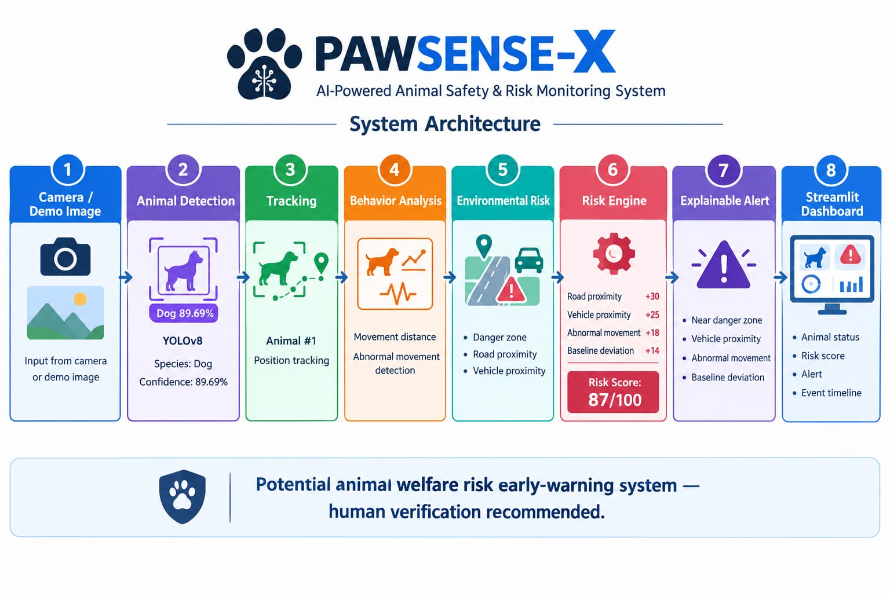
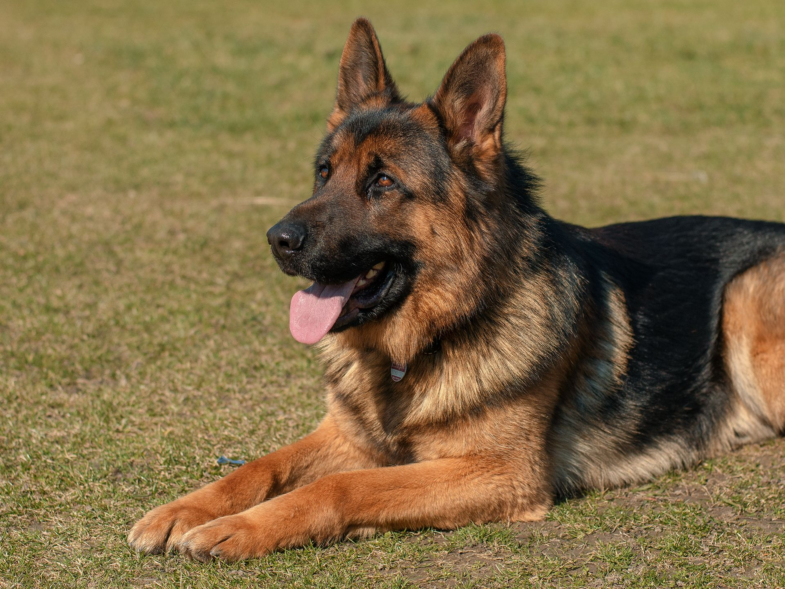

[LIVE DEMO - PAWSENSE-X](https://pawsense-x-3fgrnetrmuqbsjnsdsx85b.streamlit.app/)

# PAWSENSE-X

## AI Animal Welfare & Danger Intelligence

PAWSENSE-X is an explainable AI early-warning system designed to identify potential animal welfare risks from ordinary camera or image data.

The system combines animal detection, behavioral movement analysis, environmental danger-zone analysis, and an explainable risk engine to generate human-verifiable alerts.

## Problem

Animals can be exposed to hazards such as roads, vehicles, unsafe zones, and unusual movement patterns. Conventional camera monitoring requires continuous human attention.

PAWSENSE-X aims to provide an automated early-warning layer that highlights situations requiring human attention.

## Solution

PAWSENSE-X follows this pipeline:

Camera / Demo Image → Animal Detection → Tracking → Behavior Analysis → Danger Zone Analysis → Risk Engine → Explainable Alert → Dashboard

## Architecture

## Demo

The current prototype demonstrates detection of a dog with a confidence of approximately 89.69%.

## Key Features

- AI-based animal detection
- Animal identification and tracking ID
- Movement and behavior analysis
- Danger-zone detection
- Environmental risk analysis
- Explainable risk scoring
- Event timeline
- Streamlit monitoring dashboard
- Human-verification recommendation

## Risk Intelligence

The prototype combines multiple risk factors:

| Risk Factor | Score |
|---|---:|
| Road proximity | +30 |
| Vehicle proximity | +25 |
| Abnormal movement | +18 |
| Baseline deviation | +14 |
| Total | 87/100 |

Risk levels:

- 0–30: LOW
- 31–60: MODERATE
- 61–80: HIGH
- 81–100: CRITICAL

The displayed 87/100 score is demonstration/test data and is not a medical diagnosis.

## Explainable Alert

Example alert:

- Near danger zone
- Vehicle proximity detected
- Abnormal movement pattern
- Behavior differs from baseline

Human verification is recommended before taking action.

## Technology Stack

- Python
- OpenCV
- NumPy
- ONNX Runtime
- YOLO-based object detection
- Streamlit
- Git & GitHub

## Project Structure

PAWSENSE-X/
├── app.py
├── README.md
├── .gitignore
├── data/dog.png
├── docs/pawsense-x-architecture.png
├── src/
│   ├── pawsense_detection.py
│   ├── behavior_analysis.py
│   ├── danger_zone.py
│   ├── risk_engine.py
│   ├── event_timeline.py
│   ├── pawsense_pipeline.py
│   └── unified_intelligence.py
└── models/yolov8n.onnx

## Setup

Create a virtual environment:

python -m venv venv

Install dependencies:

pip install opencv-python numpy onnxruntime streamlit

The YOLO ONNX model is intentionally excluded from GitHub because of its file size.

Place the model at: models/yolov8n.onnx

## Run the Project

Animal Detection:
python src/pawsense_detection.py

Intelligence Pipeline:
python src/unified_intelligence.py

Streamlit Dashboard:
python -m streamlit run app.py

## Demo Output

Animal Detected: DOG
Tracking ID: Animal #1
Detection Confidence: 89.69%
Status: ACTIVE

Risk Score: 87/100
Risk Level: CRITICAL

Explainable Alert:
- Near danger zone
- Vehicle proximity detected
- Abnormal movement pattern
- Behavior differs from baseline

Human verification recommended.

## Limitations

PAWSENSE-X does not claim to diagnose pain, disease, emotions, or definitive animal welfare conditions.

It identifies potential risk indicators from visual and simulated environmental data and recommends human verification.

## Hackathon Vision

PAWSENSE-X is designed as an AI-powered early-warning platform for animal welfare monitoring.

Future development can extend the prototype toward real-time multi-animal tracking, personalized behavioral baselines, stronger anomaly detection, real-world environmental context, and long-term welfare analytics.

## Project Status

Prototype / Hackathon MVP

Core detection, behavior analysis, danger-zone analysis, risk scoring, explainable alerts, event timeline, and Streamlit dashboard are implemented.

